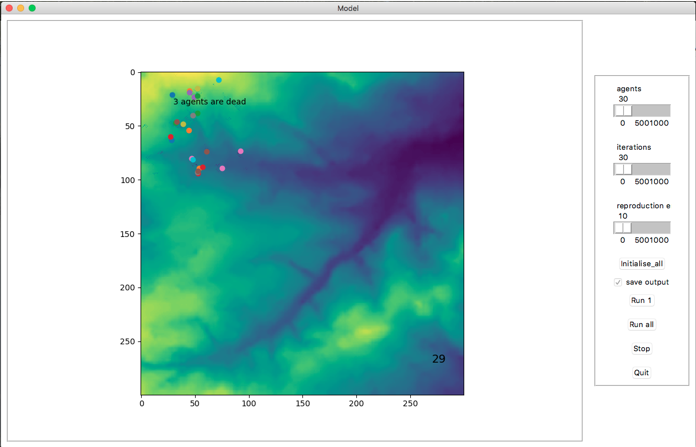

# GEOG5995
## Grazing sheep: an agent based model
Grazing sheep will give you a graphic interface to run a grazing sheep model, a simplified version of the (link).

## Installation 
The script is available here fore download

## Description 
### Data
The data used to initialise the model is available here:
- environment :
- agent coordinates:
### Animation
The animation is run through a graphic interface that enables users to navigate through options and choose model paramaters. Agents are distributed on a square lattice and are able to move around the envirment while eating and interacting. The animation will run a certain number of steps before user-defined stopping conditions are met.
#### One step
The agents will check their current state of hunger. They will move randomly to one of their neighbouring cells (queen neighbourhood), eat what is available to them, check their new state of hunger. If they have not eaten for some time, they die. They can finally interact with other agents by sharing some of their grass, and reproducing when their energy level (store of food) is sufficiently high. 

## Usage
### Running the model
This animation can be run from the command line by executing practical9b.py. Note that this script is run with python 3. 
Please download the necessary modules needed to run the script. The specific dependancies are:
- tkinter
- random
- matplotlib
- agentframework
- csv
- requests
- bs4
### Interaction with the GUI
Once the script is executed, an user interface will pop up. It is divided in two frames: a raster canvas on the left for the animation and a parameter box on the right for controlling the animation. 

### Parameters 
The interface allows users to modify several global parameters. 
- agents: change the number of agents from 0 to 1000 (default value set at 10)
- iterations: change number of iterations before stopping animation
- reproducing energy: change minimum energy level needed to reproduce

### Commands 
The interface buttons control the animation and the model output.
- initialise_all: update parameter values
- save_output: check the box if csv updated data exporting wanted. 
- Run 1: run one step of the model.
- Run: run till stopping condition.
- Stop: Pause the model.
- Quit: quit the interface. 
Note that the model can be run by the Run model tab in the menu bar. 

## Contributing
Pull requests are welcome. For major changes, please open an issue first to discuss what you would like to change.

Please make sure to update tests as appropriate.

## License
[MIT](https://choosealicense.com/licenses/mit/)
